# URECA
| Your Recommended CAfe

#### 🌱 TEAM
[😺전기범](https://github.com/woodart8)&nbsp;&nbsp;&nbsp;&nbsp;[🐕조제훈](https://github.com/JoJeHuni)&nbsp;&nbsp;&nbsp;&nbsp;[🐢방동호](https://github.com/Bang1999)&nbsp;&nbsp;&nbsp;&nbsp;[🦎최해관](https://github.com/Haegwan-Choe)&nbsp;&nbsp;&nbsp;&nbsp;[🐈이효진](https://github.com/jinjin0528)

#### 기술 스택

#### 협업 툴

### 전체 프로젝트 일정

 

프로젝트 일정 : 2024년 07월 01일 ~ 2024년 07월 09일(WBS)

  

    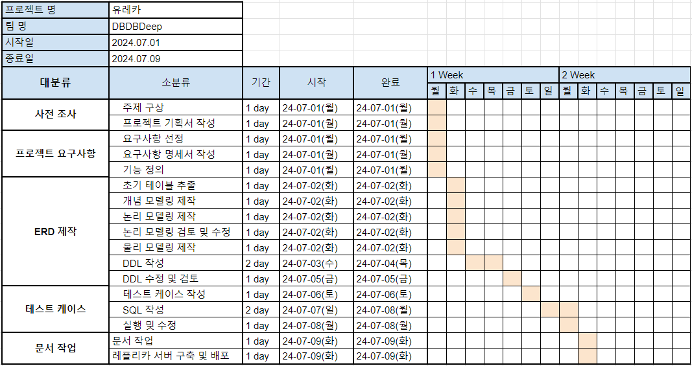
    
[WBS 문서 바로가기](https://github.com/beyond09-DBDBDeep/Ureca/blob/main/docs/WBS.pdf)

  

### 목차

- [1. 프로젝트 개요](#1-프로젝트-개요)
- [2. 국내외 유사 서비스와 차별성](#2-국내외-유사-서비스와-차별성)
- [3. 프로젝트 설계](#3-프로젝트-설계)
- [4. 프로젝트 수행 결과](#4-프로젝트-수행-결과)
- [5. 프로젝트 수행 체계](#5-프로젝트-수행-체계)
- [6. 팀 회고](#6-팀-회고)
- [7. 참고문헌](#7-참고문헌)

---

## 1. 프로젝트 개요

### 1.1 프로젝트 소개

 |
--- | --- | 

**처음 가는 카페에서 어떤 음료를 마실지 고민하시는 모든 분들!**

✔️ 유레카에서 여러 음료의 조합 정보를 서로 공유하며 꿀팁을 얻어가세요!

✔️ 분산되어 있는 카페 정보들을 한 눈에 볼 수 있습니다.

✔️ 가게 별 베스트 메뉴는 다르죠! 서로의 추천으로 메뉴 별 맛집을 찾아가세요.

---
### 1.2 프로젝트 배경

         
국내 카페 산업 현황

         

	 <b><그림 1> “한국 커피 전문점 매장 추이</b>
         
국내의 커피 전문점 수는 2023년 기준으로 약 10만 개에 이르며, 카페 창업이 늘어남에 따라 브랜드 간 경쟁이 치열해지고 있다.

         
카페는 프랜차이즈와 개인 카페로 나뉘는데, 프랜차이즈에는 스타벅스, 커피빈, 메가 커피 등 큰 규모의 카페이고, 개인 카페는 주로 주거 지역이나 핫플레이스 근처의 골목에 위치한 개인 카페이다.

         
개인 카페의 경쟁력 부족

         

	 <b><그림 2> 카페 1회 방문 시 평균 지출 금액</b>
         
개인 카페는 프랜차이즈 카페와의 가격 경쟁에서 우위를 점하기 어려운데, 이는 프랜차이즈가 큰 규모의 이점을 이용해 원재료 비용을 절감하고 가격을 낮출 수 있기 때문이다.

         
반면 개인 카페는 규모가 작기 때문에 커피 가격을 낮추는데 한계가 있다. 실제로, 평균 지출 금액을 비교해보면, 대형 프랜차이즈 카페의 가격이 더 경쟁력 있다는 것을 알 수 있다.

         
경쟁력 확보 방안과 본 프로젝트의 목표

         
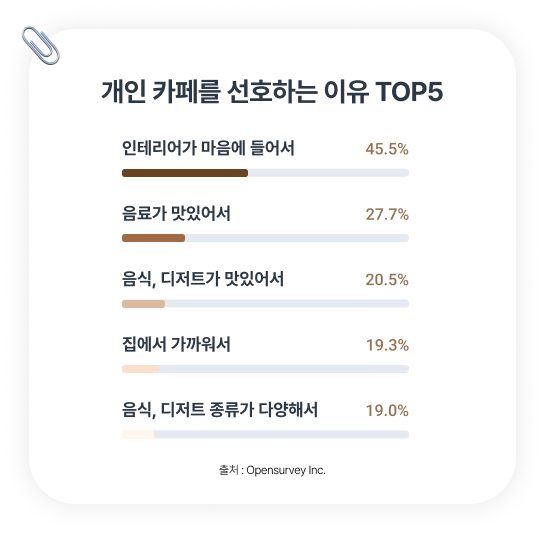

	 <b><그림 3> 개인 카페를 선호하는 이유</b>
         
따라서, 개인 카페는 가격 외의 차별화 전략으로 고객들을 찾아오게 해야 한다.

         
오픈서베이의 설문조사에 따르면, 커피 소비자들이 개인 카페를 선호하는 이유는 다음과 같이 조사되었다. 개인 카페들이 경쟁력을 갖추기 위해서는 특색 있는 인테리어, 맛있는 음료와 디저트 같은 조건을 만족해야 한다는 것이다. 카페에도 쏠림 현상이 강하기 때문에 다른 가게와의 차별화된 메뉴는 매출 상승과 직결된다.

         
다만, 모든 조건을 만족한다고 하더라도 경쟁에서 무조건 살아남을 수 있는 것은 아니다.

         
결국 매출을 올리기 위해서는 홍보가 필수적인 부분이며, 개인 카페는 프랜차이즈 카페에 비해 홍보수단이 많지 않은 실정이다. 따라서 본 프로젝트는 홍보가 어려운 개인 카페의 홍보를 도와주고, 사용자로 하여금 다양한 선택지를 가질 수 있게 하는 것을 목표로 한다.

------

## 2. 국내외 유사 서비스와 차별성

### 2.1 관련 서비스

  
 배달의 민족, 요기요, 쿠팡 

    <li> 오더(픽업 및 매장 주문) - 음식 카테고리 별 상품 </li>
    <li> 주문내역, 나의 찜(매장) </li>
    <li> 전자영수증 </li>
    <li> 계정 정보 / 개인정보 관리 </li>
    <li> 결제 수단 관리 </li>
  	<li> 배달 서비스 </li>
  	<li> 고객지원</li>

  
 스타벅스 

    <li> 오더(픽업 및 매장 주문) - 음료/푸드/상품 </li>
    <li> 나만의 메뉴(= 즐겨찾기(+ 커스텀 옵션)) </li>
    <li> 홀케이크 예약 </li>
    <li> 장바구니 </li>
    <li> 히스토리(주문 내역 조회) </li>
    <li> 별 히스토리(= 스탬프) </li>
    <li> 전자영수증 </li>
    <li> 계정 정보 / 개인정보 관리 </li>
    <li> 결제 수단 관리 </li>
    <li> 숍(온라인 스토어 : 굿즈 관련) </li>
    <li> 스타벅스 모바일 카드 선물 및 모바일 상품권 선물 </li>
    <li> 배달 서비스 </li>
    <li> 고객지원 </li>

  
 메가커피 

    <li> 멤버쉽(스탬프, 쿠폰, 외부 멤버쉽) </li>
    <li> 주문 </li>
    <li> 새소식(이벤트, 공지사항) </li>
    <li> 약관 및 정책(이용약관) </li>

  
 투썸 

    <li> 마이페이지 </li>
    <li> 메뉴소개 </li>
    <li> 매장찾기 </li>
    <li> 투썸하트(=스탬프) </li>
    <li> 쿠폰함 </li>
    <li> 이벤트 </li>
    <li> 투썸오더(주문 기능) </li>
    <li> 홀케이크24 </li>
    <li> 주문내역 </li>
    <li> 스탬프(이벤트용) </li>
    <li> 선물하기 </li>
    <li> 기프트카드(투썸카드) </li>
    <li> 마이카드(내 투썸카드 등록 및 결제, 관리) </li>
    <li> 공지사항 </li>
    <li> 고객의 소리 </li>
    <li> 제휴카드 (할인 가능 카드) </li>
    <li> 이용약관 </li>
    <li> 가맹정보 및 창업 설명회 </li>

  
 빽다방 

    <li> 스탬프 </li>
    <li> 마이쿠폰 </li>
    <li> 기프트샵(빽다방 상품권 및 기프티콘) </li>
    <li> 오더(픽업 오더 및 배달 오더 </li>
    <li> 이벤트 </li>
    <li> 매장찾기 </li>
    <li> 전자영수증 </li>
    <li> 공지사항 </li>
    <li> 이용안내 </li>
    <li> 마이페이지 </li>

  
 패스오더 

    <li> 원거리 주문, 결제 가능(매장 리스트로 주문, 지도로 주문) </li>
    <li> 테이블 주문, 결제 가능(앉은 테이블에 부착된 QR코드와 NFC인식으로 주문, 결제 가능) </li>
    <li> 맞춤형 광고 제공 </li>
    <li> 매출 분석(월별 판매 분석, 결제 수단, 매출 요약) </li>
    <li> 쿠폰함 </li>
    <li> 포인트 / 스탬프 </li>
    <li> 적립 마켓 </li>
    <li> 선물하기 </li>
    <li> 자주가요(자주가는 매장 등록) </li>

---
### 2.2 차별성

| 기능\서비스         | “유레카(URECA)”   | 스타벅스          | 메가커피     | 배달의 민족                    |
| ------------------- | ----------------- | ----------------- | ------------ | ------------------------------ |
| 즐겨찾기 저장       | O                 | O                 | X            | △(매장만 찜)                   |
| 리뷰                | O                 | △(기업 자체 설문) | X            | O                              |
| 카페 홍보           | O(위치 기반 노출) | △(자사 홍보)      | △(자사 홍보) | O(일정 요금 지불 후 상단 노출) |
| 각 메뉴의 리뷰 공유 | O                 | X                 | X            | O                              |
| 다양한 매장 입점    | O                 | X                 | X            | O                              |

---
## 3. 프로젝트 설계

### 3.1 FLOW CHARTS

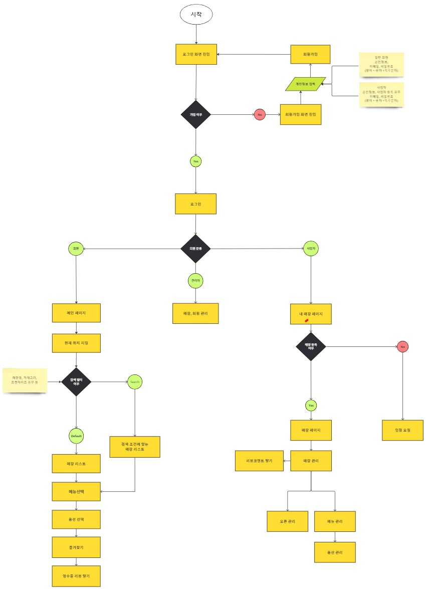

---
### 3.2 프로젝트 요구사항

	
일반 회원

<table>
    <thead>
        <tr>
            <th>요구사항 ID</th>
            <th>요구사항명</th>
            <th>요구사항 내용</th>
            <th>중요도 (상/중/하)</th>
            <th>난이도(상/중/하)</th>
        </tr>
    </thead>
    <tbody>
        <tr>
            <td>REQ-001</td>
            <td>회원 가입</td>
            <td>사용자는 카페 관리 사이트에 회원 또는 사업자로 가입할 수 있어야 함</td>
            <td>상</td>
            <td>하</td>
        </tr>
        <tr>
            <td>REQ-002</td>
            <td>회원 탈퇴</td>
            <td>사용자는 원한다면 언제든지 탈퇴할 수 있어야 함</td>
            <td>상</td>
            <td>하</td>
        </tr>
        <tr>
            <td>REQ-003</td>
            <td>로그인</td>
            <td>등록된 회원은 아이디(이메일)와 비밀번호를 사용해 로그인할 수 있어야 함</td>
            <td>상</td>
            <td>중</td>
        </tr>
        <tr>
            <td>REQ-004</td>
            <td>로그아웃</td>
            <td>회원은 언제든지 로그아웃할 수 있어야 함</td>
            <td>상</td>
            <td>하</td>
        </tr>
        <tr>
            <td>REQ-005</td>
            <td>비밀번호 변경</td>
            <td>회원은 비밀번호를 변경할 수 있어야 함</td>
            <td>상</td>
            <td>하</td>
        </tr>
        <tr>
            <td>REQ-006</td>
            <td>아이디 찾기</td>
            <td>아이디를 분실한 경우 이름과 전화번호로 찾을 수 있어야 함</td>
            <td>상</td>
            <td>하</td>
        </tr>
        <tr>
            <td>REQ-007</td>
            <td>비밀번호 찾기</td>
            <td>비밀번호를 분실한 경우 아이디, 이름, 전화번호로 찾을 수 있어야 함</td>
            <td>상</td>
            <td>하</td>
        </tr>
        <tr>
            <td>REQ-008</td>
            <td>개인 정보 수정</td>
            <td>사용자는 언제든지 개인 정보를 수정할 수 있어야 함</td>
            <td>중</td>
            <td>하</td>
        </tr>
        <tr>
            <td>REQ-009</td>
            <td>매장 조회</td>
            <td>사용자는 다양한 조건으로 매장을 검색할 수 있어야 함</td>
            <td>상</td>
            <td>하</td>
        </tr>
        <tr>
            <td>REQ-010</td>
            <td>메뉴 조회</td>
            <td>사용자는 다양한 조건으로 메뉴를 검색할 수 있어야 함</td>
            <td>상</td>
            <td>하</td>
        </tr>
        <tr>
            <td>REQ-011</td>
            <td>리뷰 조회</td>
            <td>사용자는 메뉴마다 리뷰를 조회할 수 있어야 함</td>
            <td>상</td>
            <td>상</td>
        </tr>
        <tr>
            <td>REQ-012</td>
            <td>옵션 조회</td>
            <td>사용자는 메뉴를 선택한 후 옵션을 확인할 수 있어야 함</td>
            <td>상</td>
            <td>중</td>
        </tr>
        <tr>
            <td>REQ-013</td>
            <td>리뷰 작성</td>
            <td>사용자는 즐겨찾기 된 조합에 대해 카페에 별점 및 리뷰를 작성할 수 있어야 함</td>
            <td>상</td>
            <td>하</td>
        </tr>
        <tr>
            <td>REQ-014</td>
            <td>리뷰 수정</td>
            <td>사용자는 본인이 작성한 리뷰를 수정할 수 있어야함</td>
            <td>상</td>
            <td>하</td>
        </tr>
        <tr>
            <td>REQ-015</td>
            <td>리뷰 삭제</td>
            <td>사용자는 본인이 작성한 리뷰를 삭제할 수 있어야함</td>
            <td>상</td>
            <td>중</td>
        </tr>
        <tr>
            <td>REQ-016</td>
            <td>즐겨찾기 등록</td>
            <td>사용자는 본인의 메뉴 조합으로 즐겨찾기를 등록할 수 있어야 함</td>
            <td>상</td>
            <td>상</td>
        </tr>
        <tr>
            <td>REQ-017</td>
            <td>즐겨찾기 수정</td>
            <td>사용자는 즐겨찾기에 등록한 정보를 수정할 수 있어야 함</td>
            <td>상</td>
            <td>중</td>
        </tr>
        <tr>
            <td>REQ-018</td>
            <td>즐겨찾기 삭제</td>
            <td>사용자는 즐겨찾기에 등록한 조합을 삭제할 수 있어야 함</td>
            <td>상</td>
            <td>상</td>
        </tr>
        <tr>
            <td>REQ-019</td>
            <td>매장 찜 등록, 삭제</td>
            <td>회원 사용자는 찜해두고 싶은 매장을 등록, 삭제할 수 있어야 함</td>
            <td>상</td>
            <td>하</td>
        </tr>
        <tr>
            <td>REQ-020</td>
            <td>로그인 내역 기록</td>
            <td>사용자가 회원 로그인을 시도하면 그 내역이 기록되어야 함</td>
            <td>중</td>
            <td>상</td>
        </tr>
    </tbody>
</table>

	
사업자

<table>
    <thead>
        <tr>
            <th>요구사항 ID</th>
            <th>요구사항명</th>
            <th>요구사항 내용</th>
            <th>중요도 (상/중/하)</th>
            <th>난이도(상/중/하)</th>
        </tr>
    </thead>
    <tbody>
        <tr>
            <td>REQ-021</td>
            <td>매장 등록 문의</td>
            <td>사업자인 사용자는 본인 매장에 대한 정보를 신청할 수 있어야 함</td>
            <td>상</td>
            <td>하</td>
        </tr>
        <tr>
            <td>REQ-022</td>
            <td>매장 삭제 문의</td>
            <td>폐업 시 언제든지 매장 정보를 삭제할 수 있어야 함</td>
            <td>상</td>
            <td>하</td>
        </tr>
        <tr>
            <td>REQ-023</td>
            <td>메뉴 등록</td>
            <td>사업자인 사용자 본인은 언제든지 메뉴를 등록할 수 있어야 함</td>
            <td>상</td>
            <td>중</td>
        </tr>
        <tr>
            <td>REQ-024</td>
            <td>메뉴 수정</td>
            <td>사업자인 사용자 본인은 언제든지 메뉴를 수정할 수 있어야 함</td>
            <td>상</td>
            <td>하</td>
        </tr>
        <tr>
            <td>REQ-025</td>
            <td>메뉴 삭제</td>
            <td>사업자인 사용자 본인은 언제든지 메뉴를 삭제할 수 있어야 함</td>
            <td>상</td>
            <td>하</td>
        </tr>
        <tr>
            <td>REQ-026</td>
            <td>오픈 여부</td>
            <td>사업자인 사용자 본인은 오픈 여부에 대해 언제든지 수정할 수 있어야 함</td>
            <td>상</td>
            <td>하</td>
        </tr>
        <tr>
            <td>REQ-027</td>
            <td>옵션 등록</td>
            <td>사업자인 사용자 본인은 언제든지 메뉴 옵션을 등록할 수 있어야 함</td>
            <td>상</td>
            <td>중</td>
        </tr>
        <tr>
            <td>REQ-028</td>
            <td>옵션 수정</td>
            <td>사업자인 사용자 본인은 언제든지 옵션을 수정할 수 있어야 함</td>
            <td>상</td>
            <td>하</td>
        </tr>
        <tr>
            <td>REQ-029</td>
            <td>옵션 삭제</td>
            <td>사업자인 사용자 본인은 언제든지 옵션을 삭제할 수 있어야 함</td>
            <td>상</td>
            <td>하</td>
        </tr>
        <tr>
            <td>REQ-030</td>
            <td>카테고리 등록</td>
            <td>사업자인 사용자 본인은 언제든지 메뉴 별 카테고리를 등록할 수 있어야 함</td>
            <td>상</td>
            <td>하</td>
        </tr>
        <tr>
            <td>REQ-031</td>
            <td>코멘트 등록</td>
            <td>사업자인 사용자 본인은 언제든지 회원이 남긴 리뷰에 코멘트를 등록할 수 있어야 함</td>
            <td>상</td>
            <td>하</td>
        </tr>
        <tr>
            <td>REQ-032</td>
            <td>코멘트 수정</td>
            <td>사업자인 사용자는 본인이 남긴 코멘트를 수정할 수 있어야 함</td>
            <td>상</td>
            <td>하</td>
        </tr>
        <tr>
            <td>REQ-033</td>
            <td>코멘트 삭제</td>
            <td>사업자인 사용자는 본인이 남긴 코멘트를 삭제할 수 있어야 함</td>
            <td>상</td>
            <td>하</td>
        </tr>
    </tbody>
</table>

	
관리자

<table>
    <thead>
        <tr>
            <th>요구사항 ID</th>
            <th>요구사항명</th>
            <th>요구사항 내용</th>
            <th>중요도 (상/중/하)</th>
            <th>난이도 (상/중/하)</th>
        </tr>
    </thead>
    <tbody>
        <tr>
            <td>REQ-034</td>
            <td>회원 관리</td>
            <td>관리자는 회원이나 사업자를 수정, 삭제할 수 있어야 함</td>
            <td>하</td>
            <td>하</td>
        </tr>
        <tr>
            <td>REQ-035</td>
            <td>블랙리스트 관리</td>
            <td>관리자는 회원이나 사업자를 블랙리스트 등록 및 삭제할 수 있어야 함</td>
            <td>중</td>
            <td>하</td>
        </tr>
        <tr>
            <td>REQ-036</td>
            <td>매장 관리</td>
            <td>관리자는 등록된 매장 정보를 수정 및 삭제할 수 있어야 함</td>
            <td>상</td>
            <td>상</td>
        </tr>
        <tr>
            <td>REQ-037</td>
            <td>휴면 계정 관리</td>
            <td>회원을 휴면 계정 상태로 변경하거나 휴면 해제를 할 수 있어야 함</td>
            <td>중</td>
            <td>상</td>
        </tr>
    </tbody>
</table>

[요구사항 명세서 바로가기](https://github.com/beyond09-DBDBDeep/Ureca/blob/main/docs/%EC%9A%94%EA%B5%AC%EC%82%AC%ED%95%AD%EB%AA%85%EC%84%B8%EC%84%9C.pdf)

---

### 3.3 주요기능

#### 1) 일반 회원

- 매장 검색
- 즐겨찾기
- 리뷰

#### 2) 사업자

- 매장 관리
- 메뉴 관리(등록, 수정, 삭제)
- 리뷰에 대한 코멘트

#### 3) 관리자

- 회원 관리
- 매장 관리

---
### 3.4 데이터베이스 모델링

#### (1) 개념 모델

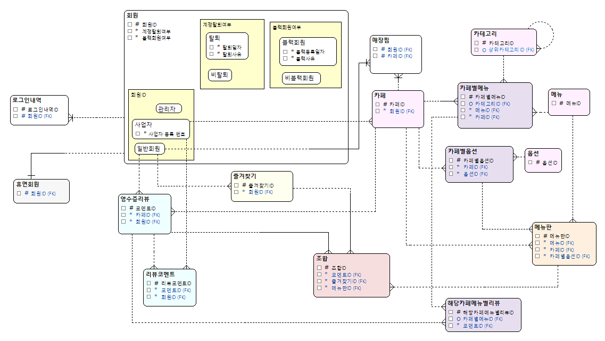

#### (2) 논리 모델

#### (3) 물리 모델

---
## 4. 프로젝트 수행 결과

### 4.1 테스트 케이스 문서

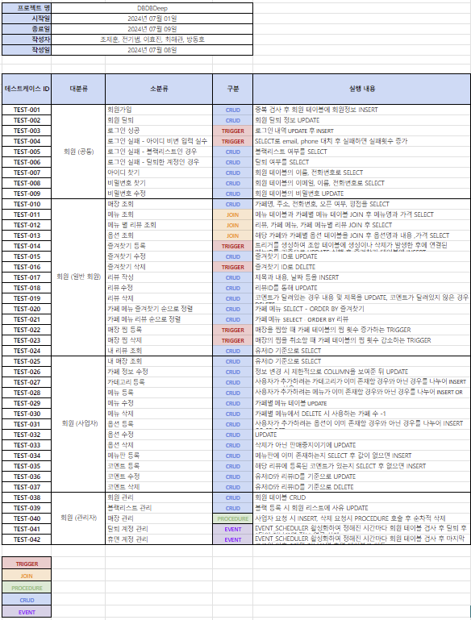

[테스트 케이스 문서 바로가기](https://github.com/beyond09-DBDBDeep/Ureca/blob/main/docs/testCase.xlsx)

---

### 4.2 테스트 결과

<b>회원</b>

    

         

         
<b>1. 회원가입</b>

         

         

	 

         
<b>2. 로그인 성공</b>

         

         

	 

         
<b>3. 로그인 실패</b>

         

         

	 

         
<b>4. 아이디 찾기</b>

         
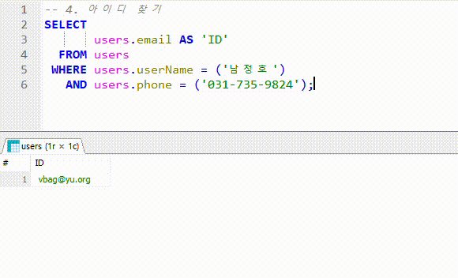

         

	 

         
<b>5. 비밀번호 찾기</b>

         
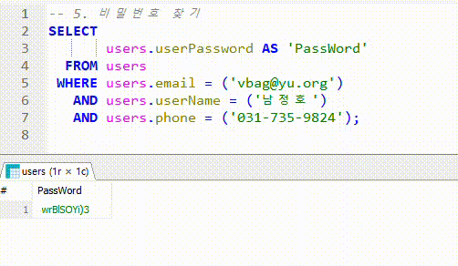

         

	 

         
<b>6. 비밀번호 수정</b>

         
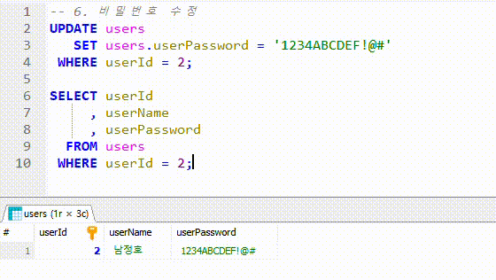

         

	 

         
<b>7. 매장 조회</b>

         
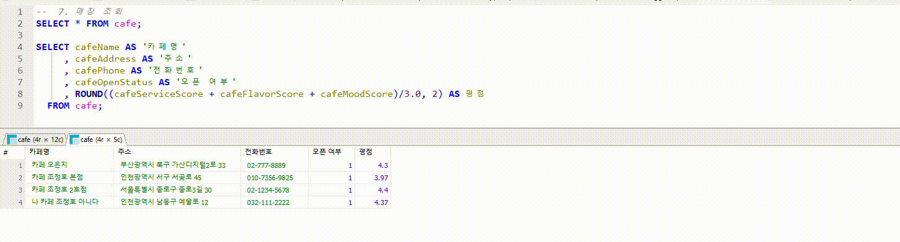

         
				 
	 

         
<b>8. 메뉴 조회</b>

         
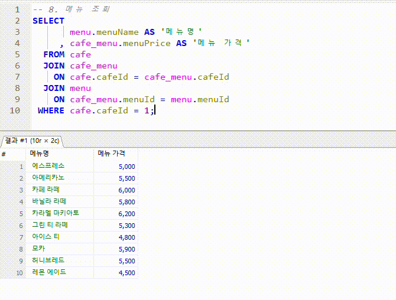

         

     

         
<b>9. 옵션 조회</b>

         
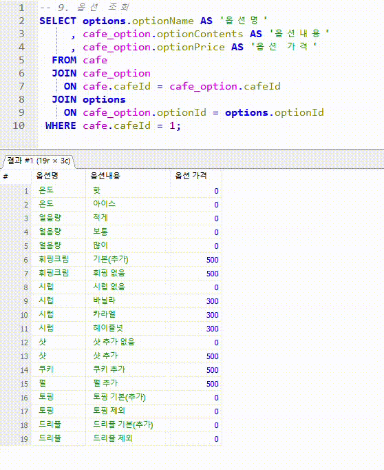

         

     

         
<b>10. 즐겨찾기 추가</b>

         

         

     

         
<b>11. 즐겨찾기 수정</b>

         
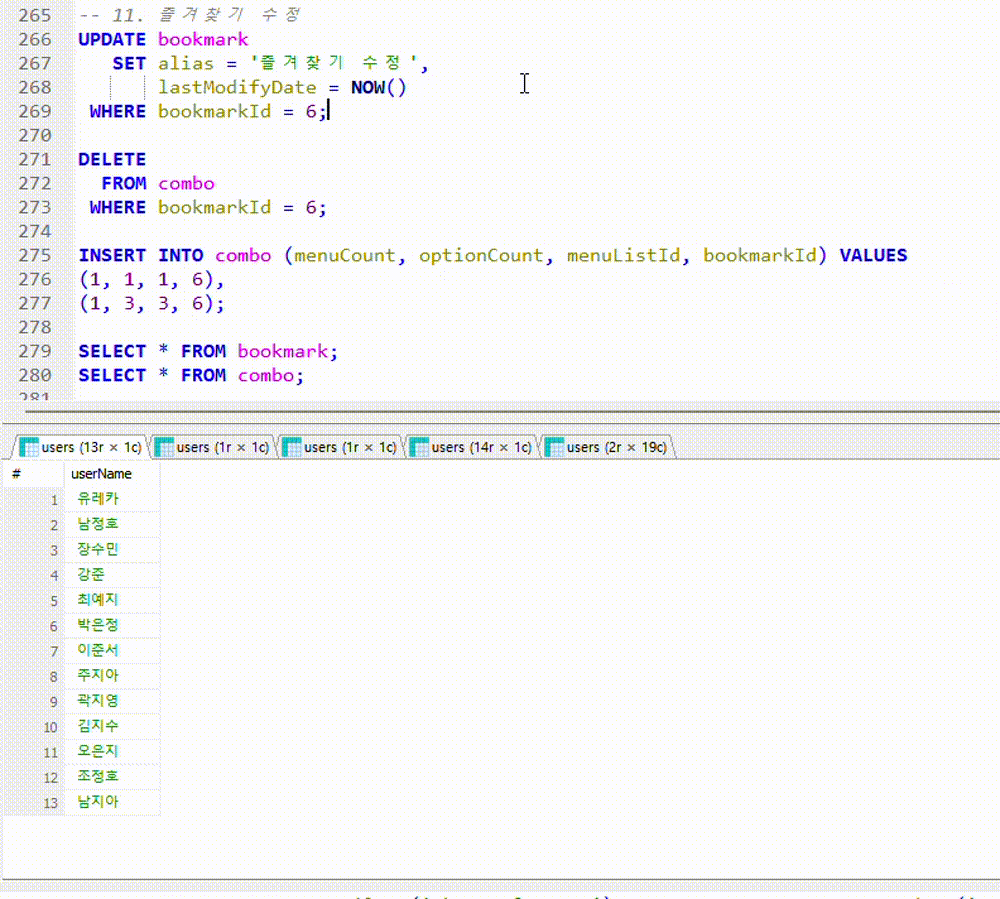

         

     

         
<b>12. 즐겨찾기 삭제</b>

         

         

     

         
<b>13. 리뷰 추가, 수정</b>

         
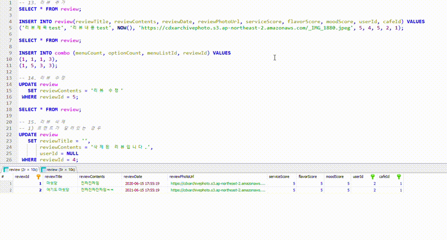

         

     

         
<b>14. 리뷰 삭제, 내 리뷰 조회</b>

         
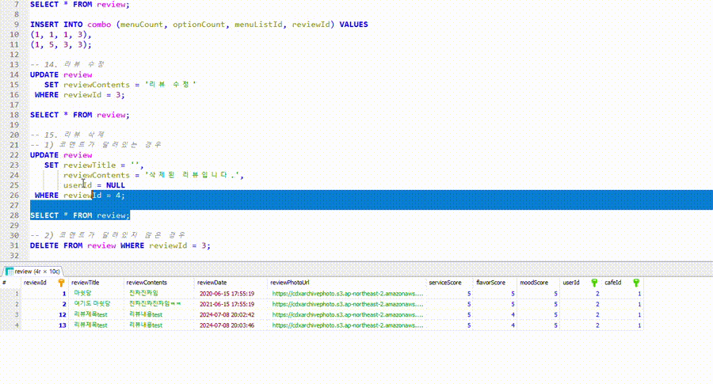

         

     

         
<b>15. 메뉴에 대한 리뷰 카운트</b>

         

         
  
    

         
<b>16. 메뉴별 리뷰 조회</b>

         

         

    

         
<b>17. 카페 찜 추가 및 삭제</b>

         

         
     
    

***

<b>사업자</b>

	

         

         
<b>1. 사업자 회원 등록</b>

         

         

         

         
<b>2. 카페 등록</b>

         

         

         

         
<b>3. 내 매장 조회</b>

         

         

         

         
<b>4. 카페 정보 수정</b>

         

         

         

         
<b>5. 카테고리 등록</b>

         

         

         

         
<b>6. 메뉴 등록</b>

         

         

         

         
<b>7. 메뉴 수정</b>

         

         

         

         
<b>8. 옵션 등록</b>

         

         

         

         
<b>9. 옵션 수정</b>

         

         

	 

         
<b>10. 메뉴, 옵션 판매 유무 수정(삭제)</b>

         

         

	 

         
<b>11. 메뉴판 등록</b>

         

         

	 

         
<b>12. 코멘트 등록</b>

         

         
    
	 

         
<b>12. 코멘트 수정</b>

         

         

	 

         
<b>12. 코멘트 삭제</b>

         

         
    
    

***

<b>관리자</b>

    

	 

         
<b>1. 블랙리스트 회원 관리</b>

         

         

	 

         
<b>2. 휴면 계정 관리</b>

         

         

   

         
<b>3. 탈퇴 회원 관리</b>

         

         

  

         
<b>4. 매장 관리</b>

         
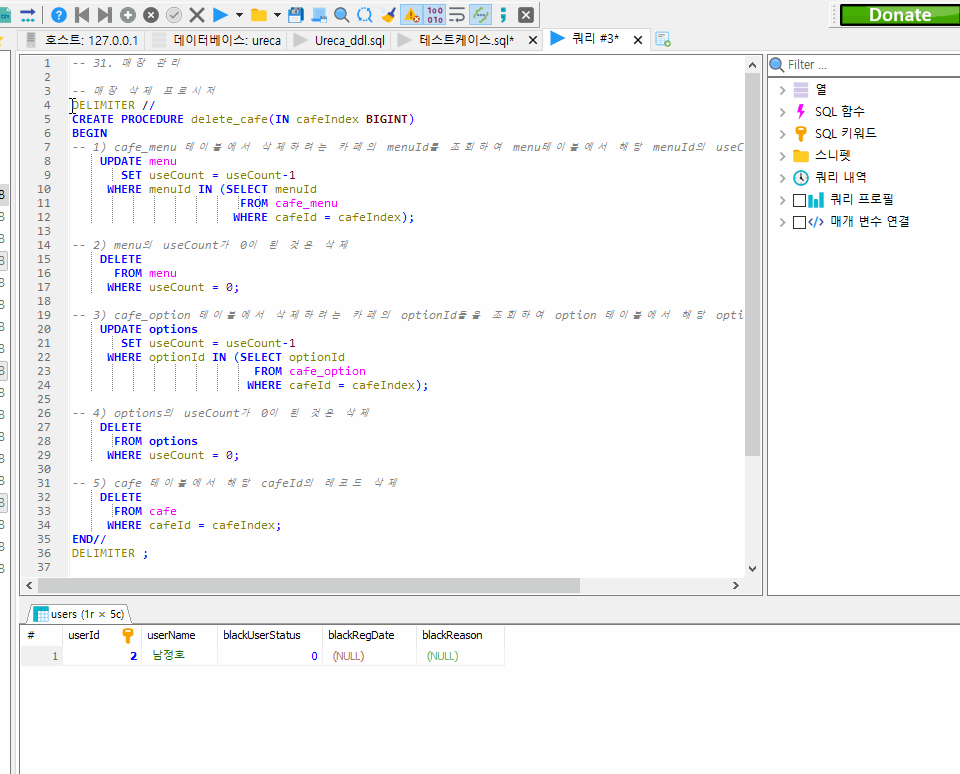

         
      
    

***

## 5. 프로젝트 수행 체계

### 5.1 팀원 인적사항

| 이름   | 전공                      | 희망직무                    | MBTI | Email                                               |
| ------ | ------------------------- | --------------------------- | ---- | --------------------------------------------------- |
| 전기범 | 소프트웨어학부            | 웹 풀스택 개발자            | INFJ | [kibeom1145@gmail.com](mailto:kibeom1145@gmail.com) |
| 조제훈 | 컴퓨터공학부              | 백엔드 개발자               | ESFJ | [cho9759@inu.ac.kr](mailto:cho9759@inu.ac.kr)       |
| 최해관 | 불교학부/융합소프트웨어   | PM / 백엔드 개발자          | ENTJ | [kkhagwan@naver.com](mailto:kkhagwan@naver.com)     |
| 이효진 | 국어국문학과/컴퓨터공학과 | 데이터 보안 / 백엔드 개발자 | INFJ | jin12lee@naver.com                                  |
| 방동호 | 모바일시스템공학과        | 백엔드 개발자               | INFP | bangdh1593@gmail.com                                |

---

### 5.2 프로젝트 수행 방법

Ubuntu Linux를 이용하여 DB 서버를 Master-Slave 형태로 Replication하였고,

권한 설정을 통해 Slave는 SELECT만 처리하게 하고, 나머지 쿼리는 Master가 처리하게 하여 서버의 부하를 줄였다.

---
## 6. 팀 회고

#### 😺전기범

> 조제훈 : 기본적인 개념에 대해서 잘 알고 계셔서 프로젝트를 진행하는데 팀원들에게도 많은 도움을 주셨고, 이끌어 가주신 팀원 중 한 분입니다. 흐름에 대해 여러 번 고민하고 최선책을 찾아 응용하는 자세가 좋았습니다. 개선이 필요한 점에 대해 미리 공유해주시기만 한다면 더욱 팀 프로젝트를 진행하는데 팀원 간 소통에 도움이 될 수 있을 것 같습니다!
> 
> 최해관 : 프로젝트의 전체적인 흐름을 잡을 수 있도록 기본 개념을 바탕으로 항상 상세히 설명해주셨습니다. 하나의 기능에 대해 상세히 분석하고 충돌되는 부분을 조언해주셔서 감사했습니다.
> 
> 이효진 : 알고 있는 게 많아서 의견도 많이 내시고 주도적이신 모습 너무 좋았습니다. 프로젝트에 있어서나 공부에 있어서 많은 도움을 주셔서 감사합니다.
> 
> 방동호 : 아이디어를 가장 많이 내셨지만, 제가 그 아이디어들을 모두 제대로 이해하지 못해서 계속 여쭤봐도 짜증 내지 않고, 어떻게 하면 더 확실하게 알려줄지 고민하며 여러 예시를 들어가며 설명해주셔서 감사했습니다.

#### 🐕조제훈

> 전기범 : 논리적, 물리적 모델링이 중간에 변경될 때마다 바로바로 수정해 주셔서 감사합니다. 고생 많으셨습니다.
>
> 최해관 : 아이디어 뱅크 역할을 너무 잘 해내셨고, 변경사항 수정 같은 번거로운 작업을 항상 도맡아 해주셨습니다. 모두가 집에 간 뒤에도 남아서 구현할 기능의 바탕을 미리 만들어주셔서 감사합니다.
>
> 이효진 : 프로젝트에 있어서 항상 주도적이고 조원들에게도 친절한 모습 너무 좋았습니다. 모르는 부분에 대해 항상 친절하게 알려주셔서 너무 감사했습니다! 
>
> 방동호 : 조가 된 첫 날부터 편하게 질문을 계속 해도 친절하게 이해가 될 때까지 답해주셔서, 덕분에 수업 과정 또는 프로젝트 진행 과정에서 가끔 따라가지 못했던 부분들을 도와주셔서 감사합니다.

#### 🦎최해관

> 전기범 : 프로젝트 중에 아이디어를 낼 때마다 긍정적으로 반응해주셔서 힘이 났습니다. 감사합니다.
>
> 조제훈 : 이전에 직접 경험했던 것을 함께 이야기하며 프로젝트를 하며 잘 나아갈 수 있게 정보 공유를 해주셨고, 팀원 간 소통에 경청하고 의견도 많이 내주셨습니다. 해결책에 대해서도 논의할 때도 도움을 많이 주셨습니다!
>
> 이효진 : 5조의 긍정맨이십니다! 항상 적극적인 자세와 조의 밝은 분위기를 책임 지시는 모습 감사했습니다.
>
> 방동호 : 먼저, 제 짝꿍이라 그런지 다른 분들보다는 더 많이 오래 지낸 느낌이 없지 않아 있네요. 그래서 다른 분들보다 감사한 점이 더 많아요. 특히 제가 수업 시간에 이해가 안 되는 부분들을 하브루타 시간뿐만 아니라 쉬는 시간 중간중간에 해결해 주시고, 혹시 모르는 게 있더라도 같이 찾아봐 주셔서 수업을 따라가는 데 있어 너무나 편안했습니다. 정말 감사했습니다.

#### 🐈이효진

> 전기범 : 맡은 부분이 난이도가 있었음에도 포기하지 않고 끝까지 해결하려는 모습을 보며 저도 많은 자극을 받았습니다. 감사합니다.
>
> 조제훈 : 프로젝트 진행 사항을 우선적으로 확실히 깨닫기 위해 2번, 3번 다시 보고 이해하면서 생긴 궁금증을 이야기하시면서 미처 놓쳤던 부분에 대해 캐치해주신다든지 함께 하려고 노력하시는 모습이 좋았습니다. 자신감을 더욱 가지셔도 좋을거 같고 더 많은 질문하는 것도 좋을 것 같습니다!
>
> 최해관 : 모두의 이야기를 잘 경청해주시고 이야기 중간마다 문제점을 확실히 파악해주시는 모습이 본받고 싶었습니다. 감사합니다.
>
> 방동호 : 프로젝트 진행 과정에서 팀원들 모두의 이야기를 들어주시고, 중간중간에 모두가 놓친 부분을 캐치하시는 모습을 보며 가끔씩 '우와~!' 했습니다. 그런 부분을 보며 많이 배워갑니다.

#### 🐢방동호

> 전기범 : 질문에 관해 설명을 해드리면서 저도 개념을 다시 한번 공부해 볼 수 있었습니다. 감사합니다.
>
> 조제훈 : 개념부터 차근차근 반복 학습하는게 정말 보기 좋았고, 궁금한걸 알려고 부끄러워하는 것이 아닌 질문도 많이 하시고 노력하시는 모습도 좋았습니다. 팀플하는 동안 의견도 열심히 내주시고 뭐 하나 허투루 넘기지 않으려는 자세가 좋았습니다!
>
> 최해관 : 이해 안가는 부분에 대해 저와 이야기를 많이 나누었는데 그 과정에서 제가 잘못 알고 있던 것도 바로잡으며 많은 공부가 되었습니다. 프로젝트를 진행하다보면 전체 흐름과 맞지 않게 진행이 될 때가 있는데 그 때마다 중요한 문제점을 간파하고 의견을 내주셔서 바른 길로 갈 수 있었습니다. 감사합니다.
>
> 이효진 : 항상 배우려는 자세와 궁금한 것엔 적극적으로 물어보시는 것을 보고 많이 배울 수 있었습니다. 계속 물어보시면서 좋은 의견 내주시면서 많은 도움이 되었어요. 감사합니다.

---
## 7. 참고 문헌

- <그림 1> : https://www.loud.kr/article/successcase/79001
- <그림 2> : https://www.loud.kr/article/successcase/79001
- <그림 3> : https://www.loud.kr/article/successcase/79001
- https://www.sisajournal.com/news/articleView.html?idxno=250943 **, 2022.11.21**
